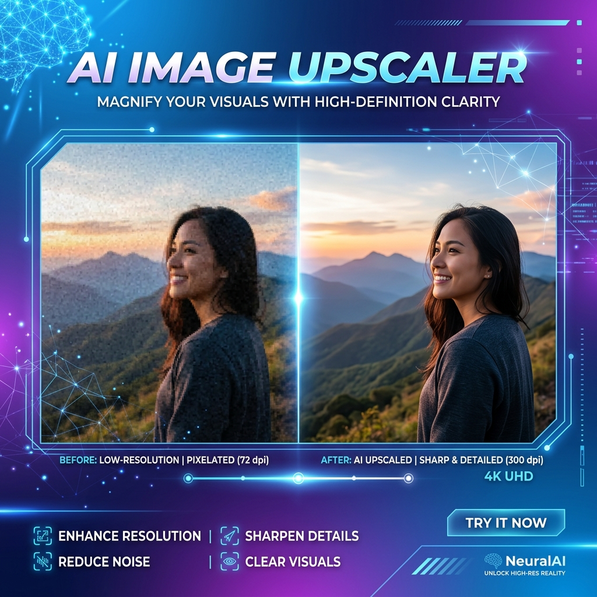
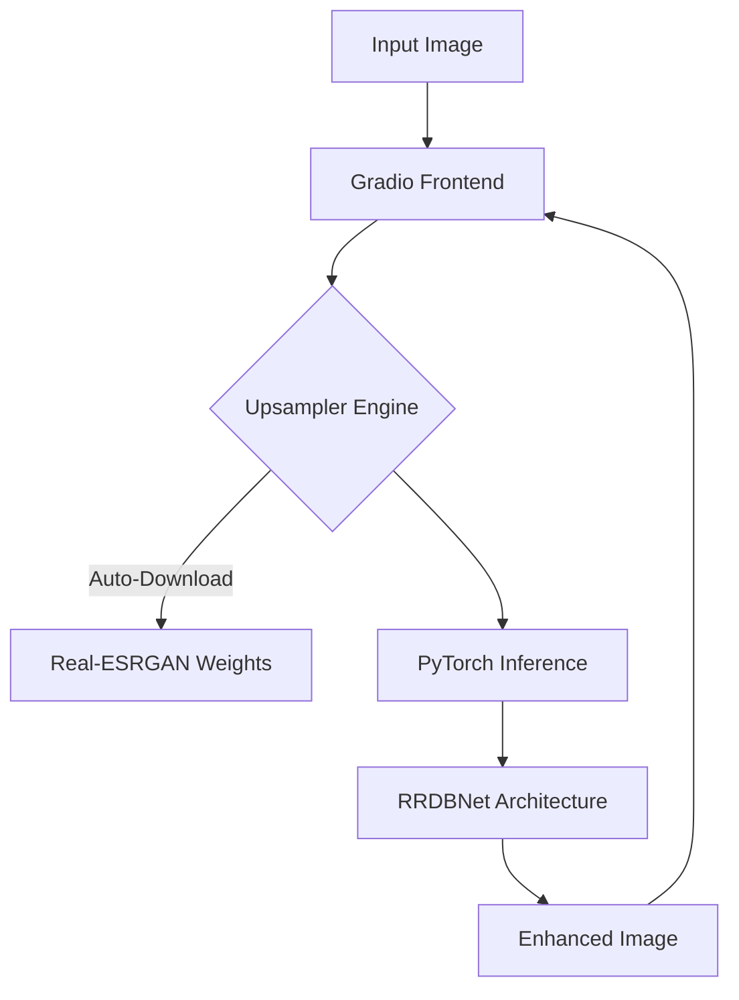

# 🔍 AI Image Upscaler



[](https://www.python.org/downloads/)
[](https://gradio.app/)
[](https://github.com/xinntao/Real-ESRGAN)
[](./Dockerfile)
[](https://opensource.org/licenses/Apache-2.0)

A powerful, high-performance image restoration and upscaling tool powered by **Real-ESRGAN**. This project provides a seamless web interface to transform low-resolution images into high-fidelity, crystal-clear masterpieces using state-of-the-art Deep Learning.

---

## ✨ Key Features

- **🚀 Dual Upscaling Modes**: Choose between **2x** and **4x** upscaling factors.
- **🧠 State-of-the-art Architecture**: Leverages the **RRDBNet** (Residual-in-Residual Dense Block) architecture for superior detail recovery.
- **⚡ Automated Model Management**: Smart logic to detect and download model weights (`RealESRGAN_x4plus.pth`) on first run.
- **🌐 Responsive UI**: Clean and modern web interface built with **Gradio**, optimized for both desktop and mobile.
- **🐳 Cloud Ready**: Fully containerized with Docker, making it easy to deploy on Hugging Face Spaces or any cloud provider.
- **💨 Optimized Performance**: Built-in model caching and stream buffering for rapid inference.

---

## 🛠 Technology Stack



- **Core**: [PyTorch](https://pytorch.org/) & [Torchvision](https://pytorch.org/vision/stable/index.html)
- **Model Architecture**: [Real-ESRGAN](https://github.com/xinntao/Real-ESRGAN) (via `realesrgan` & `basicsr`)
- **UI Framework**: [Gradio](https://gradio.app/)
- **Package Manager**: [uv](https://github.com/astral-sh/uv)
- **Containerization**: Docker

---

## 🚀 Quick Start

### 1. Prerequisites
Ensure you have Python 3.11+ installed. We recommend using `uv` for lightning-fast dependency management.

### 2. Installation

**Using `uv` (Recommended):**
```bash
# Install uv if you haven't
powershell -c "irm https://astral.sh/uv/install.ps1 | iex"

# Sync dependencies and run
uv run main.py
```

**Using `pip`:**
```bash
pip install -r requirements.txt
python main.py
```

### 3. Running with Docker
```bash
# Build the image
docker build -t image-upscaler .

# Run the container
docker run -p 7860:7860 image-upscaler
```

---

## 📖 Usage Guide

1. **Upload**: Drop your image into the "Input Image" box.
2. **Configure**: Select your preferred **Upscale Factor** (2 or 4).
3. **Enhance**: Click the **Upscale** button.
4. **Download**: Once processed, your high-resolution image will appear in the output gallery, ready for download!

---

## 🔬 Model Information

The project uses the **Real-ESRGAN_x4plus** model, which is trained on a synthetic dataset to handle a wide range of real-world degradations. 

- **Backbone**: RRDB (Residual-in-Residual Dense Block)
- **Input**: 3-channel RGB images
- **Output**: 4x (native) or 2x (downsampled) enhanced versions

---

## 🤝 Contributing

Contributions are welcome! If you have ideas for new features or improvements, feel free to open an issue or submit a pull request.

---

## 📄 License

This project is licensed under the **Apache License 2.0**. See the [LICENSE](LICENSE) file for details.

*Note: The underlying Real-ESRGAN models may have their own respective licenses.*

---
<p align="center">Made with ❤️ for the AI community</p>
